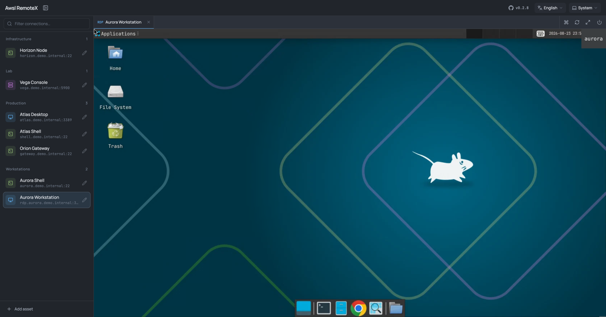

# Awsl RemoteX

**English** | [简体中文](README.zh-CN.md)

A focused browser workspace for SSH, RDP, and VNC. Keep assets in one sidebar, open several remote sessions in tabs, and switch between them without leaving the page.



## Highlights

- SSH, RDP, and VNC through Apache Guacamole
- Multiple live sessions with compact tabs
- Double-click connection and encrypted automatic login
- Asset creation, editing, deletion, and connection testing
- A fully hideable sidebar and responsive remote display
- Reconnect, disconnect, fullscreen, soft keyboard, and custom key combinations
- One Half Dark, One Half Light, and system-aware themes
- English and Chinese interfaces
- Installable PWA with automatic updates
- Optional application authentication
- Local SQLite storage with no external database

Awsl RemoteX is intentionally limited to remote control. It does not include session recording, playback, approval workflows, command auditing, or an internal web proxy.

## Getting started

Create an `.env` file. Replace every example secret before starting the service.

```dotenv
GUACAMOLE_JSON_SECRET=<output of openssl rand -hex 16>
CREDENTIAL_KEY=<output of openssl rand -hex 32>
AUTH_USERNAME=admin
AUTH_PASSWORD=change-this-password
GUACAMOLE_SESSION_TIMEOUT_MINUTES=1440
SESSION_IDLE_TIMEOUT=24h
```

`AUTH_USERNAME` defaults to `admin`. `AUTH_PASSWORD` enables application login; leave it empty only when you intentionally want authentication disabled. Use HTTPS whenever the service is reachable beyond a trusted network.

Use the following Compose file:

```yaml
services:
  awsl-remotex:
    build:
      context: .
      dockerfile: Dockerfile.dev
    ports:
      - "8080:8080"
    volumes:
      - ./data:/app/data
    environment:
      AUTH_USERNAME: ${AUTH_USERNAME:-admin}
      AUTH_PASSWORD: ${AUTH_PASSWORD:-}
      CREDENTIAL_KEY: ${CREDENTIAL_KEY:?set CREDENTIAL_KEY}
      GUACAMOLE_JSON_SECRET: ${GUACAMOLE_JSON_SECRET:?set GUACAMOLE_JSON_SECRET}
      GUACAMOLE_UPSTREAM: http://guacamole:8080
      GUACD_ADDRESS: guacd:4822
      SESSION_IDLE_TIMEOUT: ${SESSION_IDLE_TIMEOUT:-24h}
    depends_on:
      - guacamole
    restart: unless-stopped

  guacd:
    image: guacamole/guacd:1.6.0
    restart: unless-stopped

  guacamole:
    image: guacamole/guacamole:1.6.0
    environment:
      GUACD_HOSTNAME: guacd
      JSON_ENABLED: "true"
      JSON_SECRET_KEY: ${GUACAMOLE_JSON_SECRET:?set GUACAMOLE_JSON_SECRET}
      API_SESSION_TIMEOUT: ${GUACAMOLE_SESSION_TIMEOUT_MINUTES:-1440}
    depends_on:
      - guacd
    restart: unless-stopped
```

Start the stack and open `http://localhost:8080`:

```bash
docker compose up -d --build
```

## Using the workspace

1. Add an SSH, RDP, or VNC asset from the bottom of the sidebar.
2. Single-click to select an asset or double-click to connect immediately.
3. Open the asset editor to update, test, or delete the connection.
4. Switch between active sessions through the tab bar. Session controls remain on its right side.

## Documentation

- [Documentation index](docs/README.md)
- [Architecture](docs/architecture.md)
- [Configuration](docs/configuration.md)

Saved passwords and private keys are encrypted with AES-256-GCM before being written to SQLite. Asset APIs never return stored credential values.
