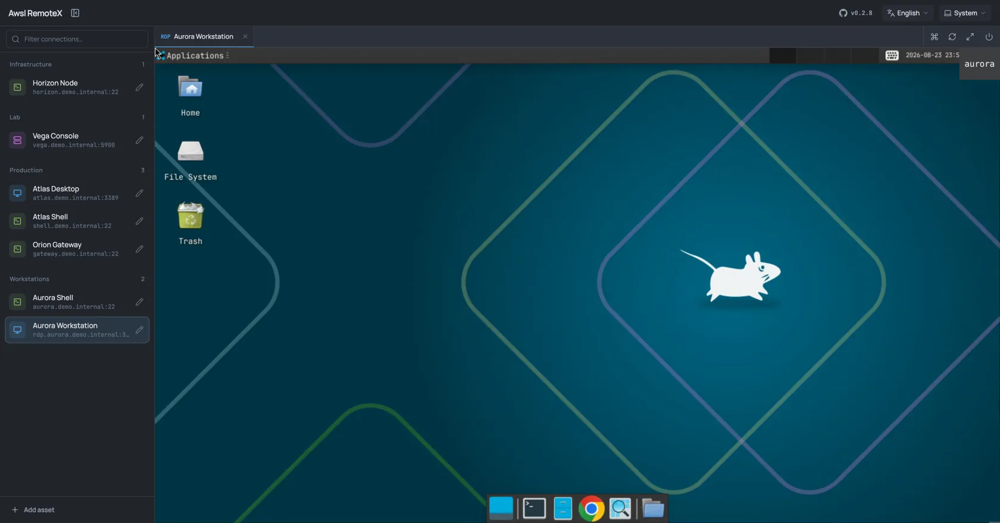

# Awsl RemoteX

[English](README.md) | **简体中文**

一个专注于 SSH、RDP 和 VNC 的浏览器远程工作台。资产统一放在侧边栏，多个远程会话通过 Tab 同时保持在线，无需离开页面即可快速切换。



## 核心能力

- 基于 Apache Guacamole 支持 SSH、RDP 和 VNC
- 多会话同时在线，使用紧凑 Tab 快速切换
- 双击直接连接，凭据加密保存后可自动登录
- 资产添加、编辑、删除及真实连接测试
- 侧边栏可完全隐藏，远程画面自动适配可用空间
- 重连、断开、全屏、软键盘及自定义快捷键
- One Half Dark、One Half Light 与跟随系统主题
- 中文和英文界面
- 可安装 PWA，并自动更新
- 可选的系统账号密码认证
- SQLite 本地存储，无需外部数据库

Awsl RemoteX 只专注远程控制，不包含会话录制、录像回放、审批流、命令审计或内网网页代理。

## 快速开始

创建 `.env` 文件，启动前请替换所有示例密钥和密码。

```dotenv
GUACAMOLE_JSON_SECRET=<openssl rand -hex 16 的输出>
CREDENTIAL_KEY=<openssl rand -hex 32 的输出>
AUTH_USERNAME=admin
AUTH_PASSWORD=change-this-password
GUACAMOLE_SESSION_TIMEOUT_MINUTES=1440
SESSION_IDLE_TIMEOUT=24h
```

`AUTH_USERNAME` 默认是 `admin`。设置 `AUTH_PASSWORD` 后启用系统登录；只有明确不需要认证时才应留空。服务只要超出可信内网范围，就应同时启用 HTTPS。

使用下面的 Compose 文件：

```yaml
services:
  awsl-remotex:
    build:
      context: .
      dockerfile: Dockerfile.dev
    ports:
      - "8080:8080"
    volumes:
      - ./data:/app/data
    environment:
      AUTH_USERNAME: ${AUTH_USERNAME:-admin}
      AUTH_PASSWORD: ${AUTH_PASSWORD:-}
      CREDENTIAL_KEY: ${CREDENTIAL_KEY:?set CREDENTIAL_KEY}
      GUACAMOLE_JSON_SECRET: ${GUACAMOLE_JSON_SECRET:?set GUACAMOLE_JSON_SECRET}
      GUACAMOLE_UPSTREAM: http://guacamole:8080
      GUACD_ADDRESS: guacd:4822
      SESSION_IDLE_TIMEOUT: ${SESSION_IDLE_TIMEOUT:-24h}
    depends_on:
      - guacamole
    restart: unless-stopped

  guacd:
    image: guacamole/guacd:1.6.0
    restart: unless-stopped

  guacamole:
    image: guacamole/guacamole:1.6.0
    environment:
      GUACD_HOSTNAME: guacd
      JSON_ENABLED: "true"
      JSON_SECRET_KEY: ${GUACAMOLE_JSON_SECRET:?set GUACAMOLE_JSON_SECRET}
      API_SESSION_TIMEOUT: ${GUACAMOLE_SESSION_TIMEOUT_MINUTES:-1440}
    depends_on:
      - guacd
    restart: unless-stopped
```

启动后访问 `http://localhost:8080`：

```bash
docker compose up -d --build
```

## 使用方式

1. 从侧边栏底部添加 SSH、RDP 或 VNC 资产。
2. 单击资产进行选中，双击立即连接。
3. 在资产编辑弹窗中修改、测试或删除连接。
4. 通过 Tab 切换在线会话，右侧始终保留当前会话操作。

## 文档

- [文档索引](docs/README.md)
- [架构说明](docs/architecture.md)
- [配置说明](docs/configuration.md)

保存的密码和私钥会使用 AES-256-GCM 加密后写入 SQLite，资产 API 不会返回已保存的凭据内容。
